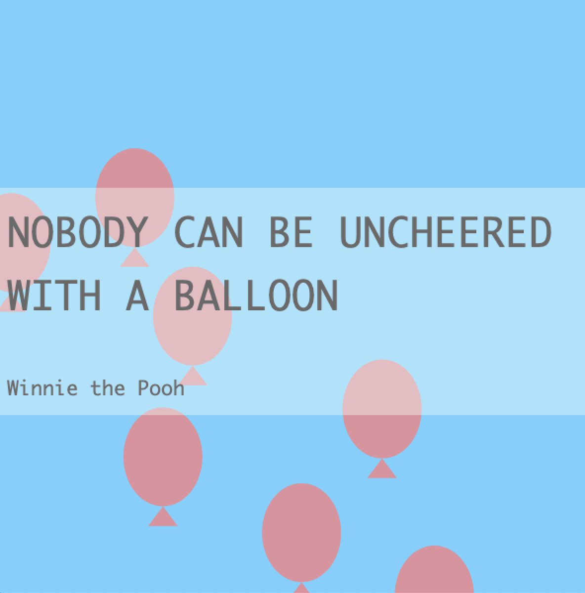

## Pop Balloons!

**[Link to Video](https://youtu.be/ITX4RcDfK48)**

### Description
In times of uncertainty and trouble, I wanted to create a light-hearted/cheerful card with a note that would hopefully make people smile. Hence came my idea to display the Winnie the Pooh quote "nobody can be uncheered with a balloon" along with balloons going up in the sky. The balloons can be popped by placing the mouse on them for a certain amount of time until the balloon becomes "too big". This is demonstrated in the video above.

In accordance to the instructions for this assignment to incorporate object-oriented programming, I created one class, "balloon", which determined the main features of the balloons being displayed. This includes the location, shape, movement, and interactivity of the balloon.
Aside from OOP, I controlled the number of balloons coming up at once by using a timer, so that only a certain amount is displayed on the screen within the given amount of time (but this happens continuously). 

Even though I didn't encounter any significant challenges while coding, I do want to learn how I can make it so that all of the balloons collide with each other. Is it possible to incorporate this feature within the class, or do I have to code it in the draw section?

### Images

### References
- https://github.com/michaelshiloh/simpleProcessingClassExample
- http://learningprocessing.com/examples/chp10/example-10-10-rain-catcher-game
- https://wp.nyu.edu/abudhabi_im_intro/meeting-16-week-8-long-day-thursdayapril2/
- https://processing.org/reference/PFont.html
- https://www.goodreads.com/quotes/182115-nobody-can-be-uncheered-with-a-balloon
