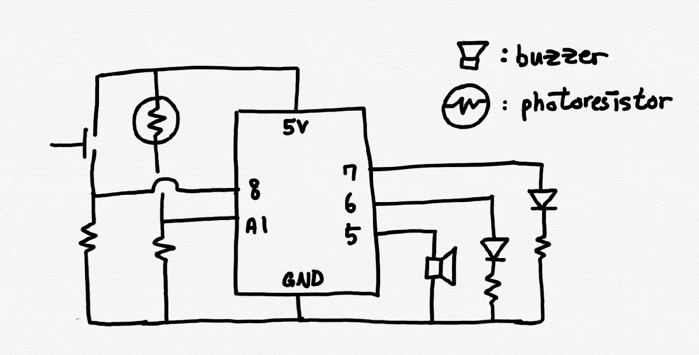
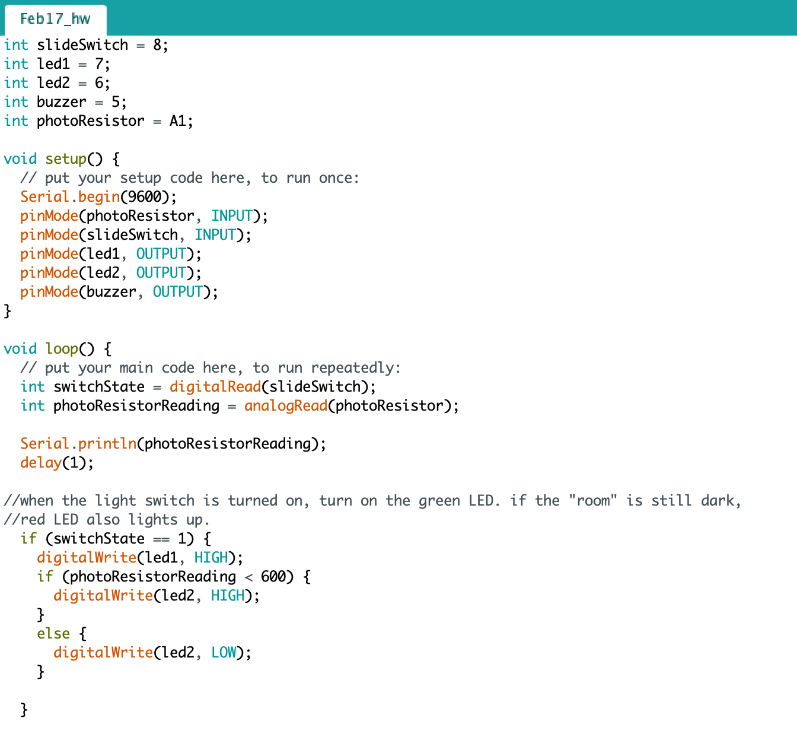

**It is Scary without Light**

**[Link to Video](https://www.youtube.com/watch?v=lDTf7pZYZvw)**

My project for Assignment 3 envisions a room that gets scary when its lights are turned off. The circuit uses two LED lights, one piezo buzzer, one slide switch, and one photoresistor to incorporate the following features:

1. When the slide switch is on, the green LED automatically lights up. The red LED lights up if the room still seems dark based on the photoresistor, which is when an object (hand) is over the photoresistor and its sensor value goes down.  
2. When the slide switch is off, none of the LED lights are on. Instead, the buzzer beeps (making the "room" a haunted experience with loud noise/screaming), and the frequency of the beeps gets faster as the room gets darker (sensor value decreases).  

The green LED is controlled purely in a digital fashion. The red LED is still digital but it lighting up or not depends on the photoresistor's sensor value (whether it is less or greater than the pre-determined value).
Furthermore, although turning the buzzer on/off is managed in a digital system, the frequency of the beeps is controlled in an analog manner.

**Schematic**

**Set-Up**

**Program**

Reference:
- https://www.programmingelectronics.com/an-easy-way-to-make-noise-with-arduino-using-tone/
