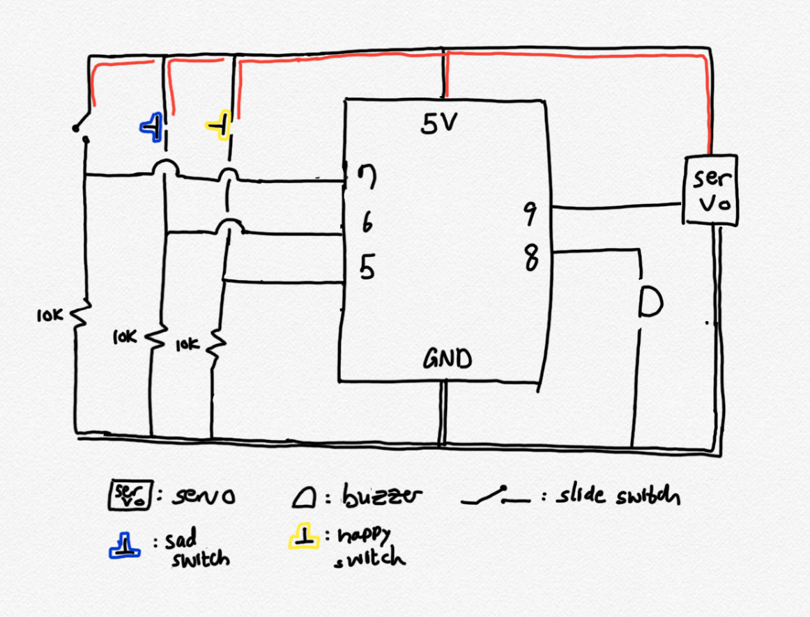
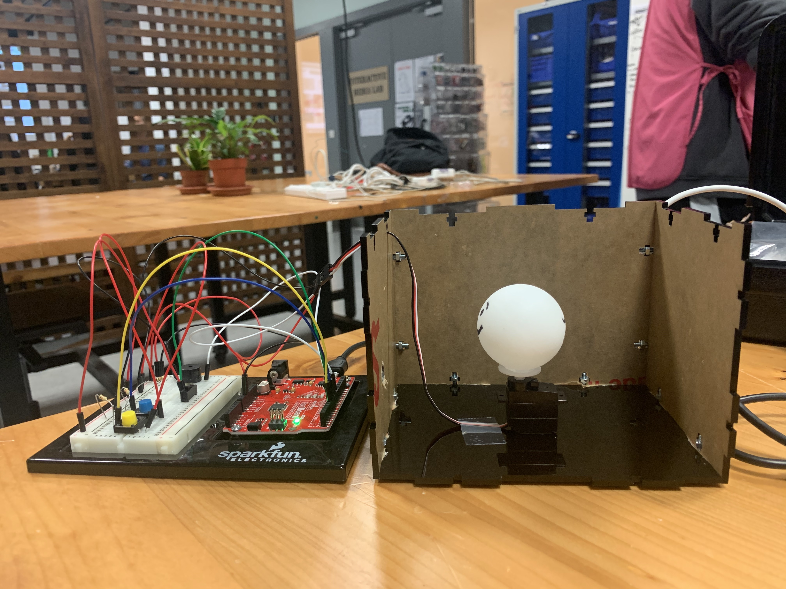

## Theatre Orchestra

**[Link to Video](https://www.youtube.com/watch?v=Yf3Aukl5db8)**

My musical instrument, called "Theatre Orchestra", plays two different melodies depending on what scene is being performed on the stage. To elaborate, when the happy face is displayed, the melody of "Ode to Joy" by Beethoven is played, whereas when the sad face is displayed, the melody of "Swan Lake" by Tchaikovsky is played.

The face being shown on stage changes through a servo with a ping pong ball attached to it. The ball has the happy and sad faces drawn on opposite sides. The melodies are played on the piezo buzzer.
The user can change the side of face and the melody by clicking the yellow button (happy face) or the blue button (sad face). The melody has to end for the user to change/repeat the scene or turn off the system.
The entire system can be turned off using the slide switch, where the ball/servo changes its angle so that neither of the faces are shown.

<Method>

I used if, else if, and else statements to control the system (servo and buzzer) based on the slide/button switches.

To play the melodies, I used the *tone* and *noTone*, referencing the "toneMelody" example code, which also had the pitches.h file. I coded the melodies using music sheets I got from the internet:
- [Ode to Joy](https://www.music-scores.com/midi.php?sheetmusic=Beethoven_Ode_to_Joy_easy)
- [Swan Lake](https://www.music-for-music-teachers.com/easy-piano-sheet-music.html)

To make the servo move, I referenced the "knob" example code, especially the myservo.write(angle) function. I made it so that the servo move to 0, 90, and 180 degrees based on what switches are turned on/off.

<Potential Problems>
  
One issue I had while coding this was that I couldn't make the melody stop and move onto the next motion (when the button switch is clicked or the slide switch is turned off). There may be a specific code/function that would allow this to happen, but I didn't get to figure out which one.

### Schematic

### Photo

**Set-Up**

**Close-Up**

