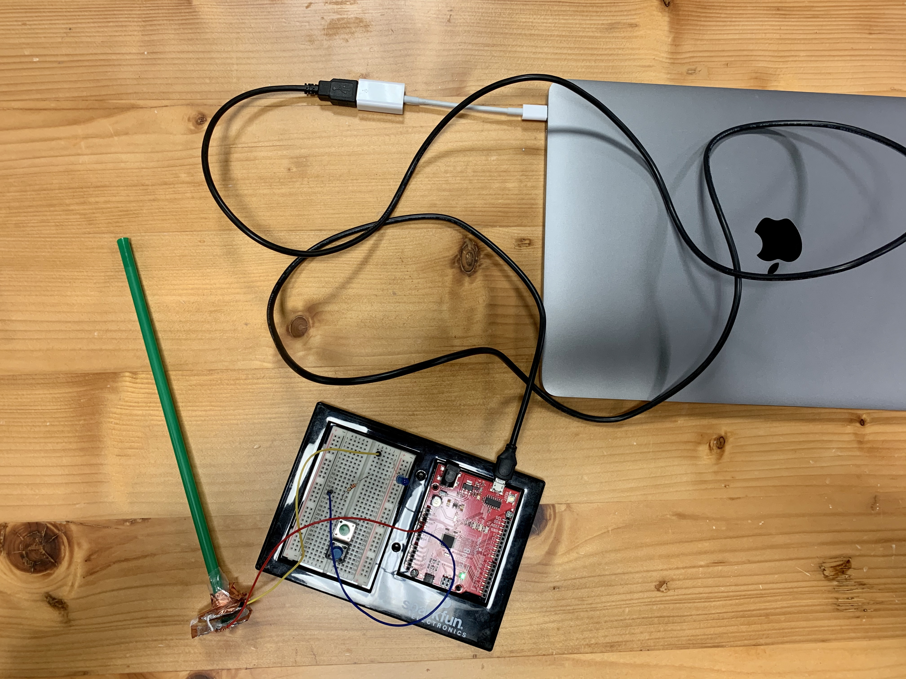

**Introducing the Straw Switch**

**[Link to Video](https://www.youtube.com/watch?v=NvTYCpT5Ic8)**

We usually use straws to drink beverages. But now, we can use a straw, or the straw switch, to turn on a light!

Similar to how we suck liquids to drink through a straw, we can suck air, creating inward pressure, through the straw switch to turn on a light.

To elaborate, the switch has two components: the upper part, which is a plastic straw with aluminium foil / copper tape attached to it, and the lower part, which is a base made of aluminium foil / copper tape. When the switch is left as it is, the LED light is not on. However, when the user inhales air through the straw, the air pressure makes the lower part touch the upper part, ultimately turning the light on. This happens because aluminium foil / copper tape conducts electricity and two disconnected wires from an LED circuit are each attached to the upper and lower part. When the two components are detached from each other, the electrons cannot pass through the two wires, resulting in an open circuit. On the other hand, when the components are touching, the wires are in contact for electrons to flow, creating a closed circuit and turning on the light. 

The straw switch has its pros and cons. Most importantly, it achieves its purpose as a switch that doesn’t use people’s hands. Moreover, it is portable and quite easy to use, since the user simply has to inhale air through the straw to light up the LED bulb. However, it isn’t very practical because it requires the user to draw in breath, often for a long time, which is hard to do.  

**Image**

Close-up

Whole Setup

