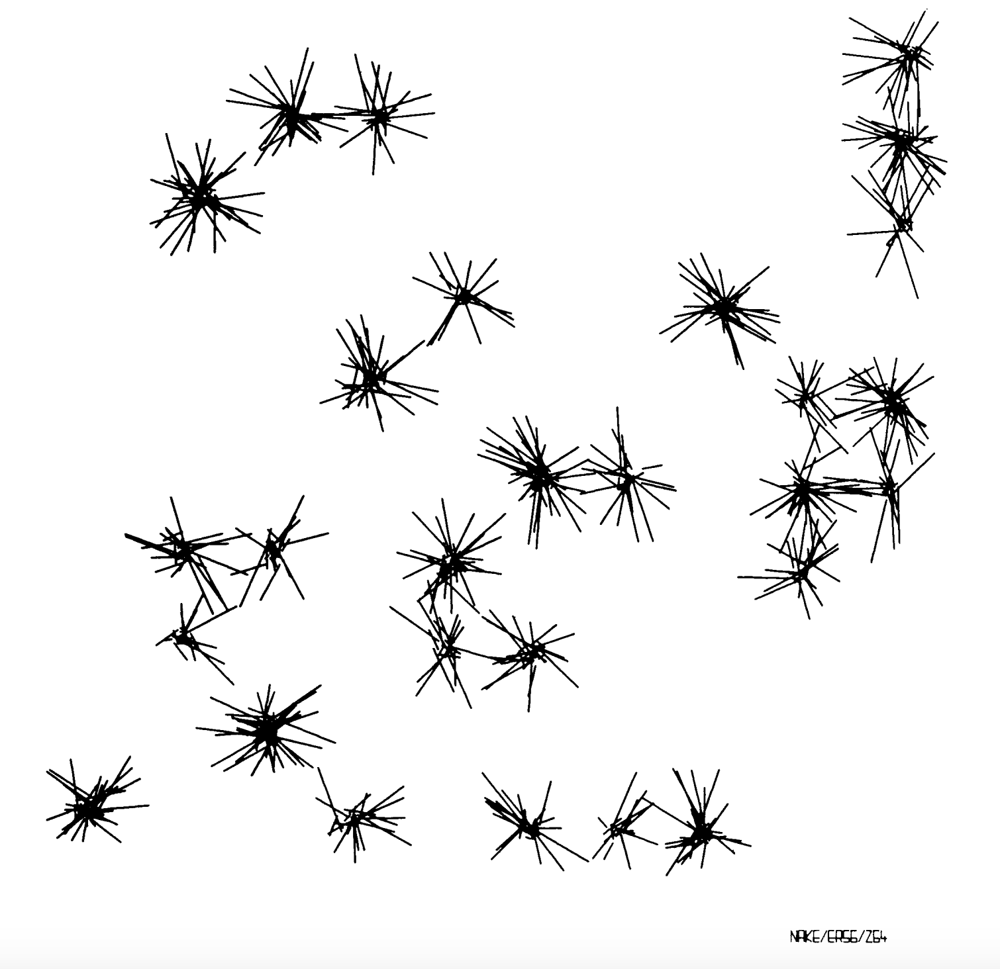

## Sparkles: Computer Art

**[Link to Video](https://youtu.be/cuMMVTptojc)**

### Description
For my computer art, I took inspiration from the following art piece:

(pg. 19, http://dada.compart-bremen.de/docUploads/ProgrammInformation21_PI21.pdf)

Unlike the printed artwork, my final product is interactive with the user being able to add other "sparkles" to it by clicking on different areas. The longer the mouse is clicked, the more strokes on the sparkle there will be. The color, length, and direction of the strokes are chosen randomly. The video above illustrates how this interactivity works.

Fortunately, I didn't encounter many problems while working on this. What I do want to learn, however, is how to set the maximum number of strokes that a user can put on one location/sparkle. I wasn't able to accomplish this with the for loop.

One part of the code that may be confusing is how the for loop (in the set-up) works since it doesn't determine the number of sparkles but rather the number of strokes in a sparkle. In fact, the "sparkle" function instructs the process of creating the sparkle, which is randomly generated through a series of strokes centered on one point. Therefore, the "sparkle" function creates strokes (that combine to become a sparkle) not directly the sparkle itself.

### Image

### Reference
- http://dada.compart-bremen.de/docUploads/ProgrammInformation21_PI21.pdf
- https://processing.org/reference/line_.html
- https://processing.org/tutorials/transform2d/
- https://wp.nyu.edu/abudhabi_im_intro/meeting-14-week-7-long-day-thursday-march-19-240-520/
- https://processing.org/tutorials/interactivity/
