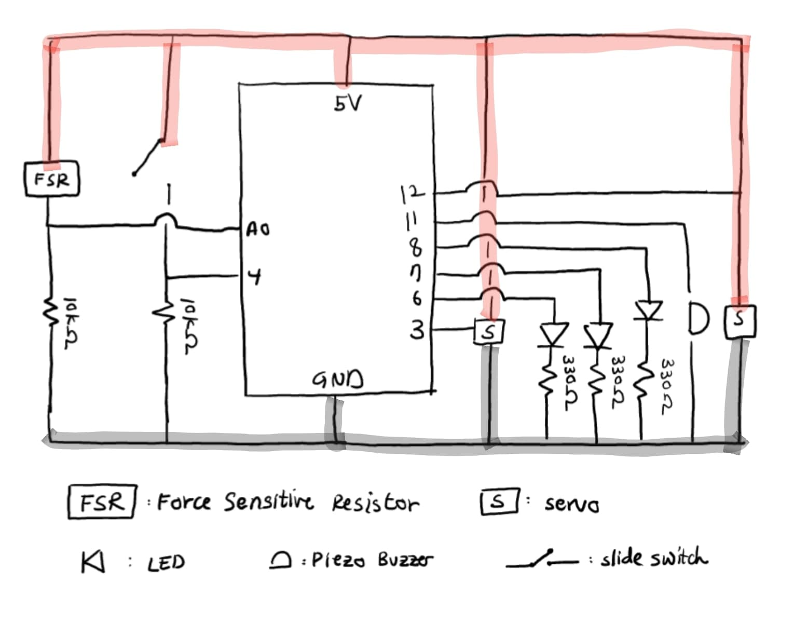
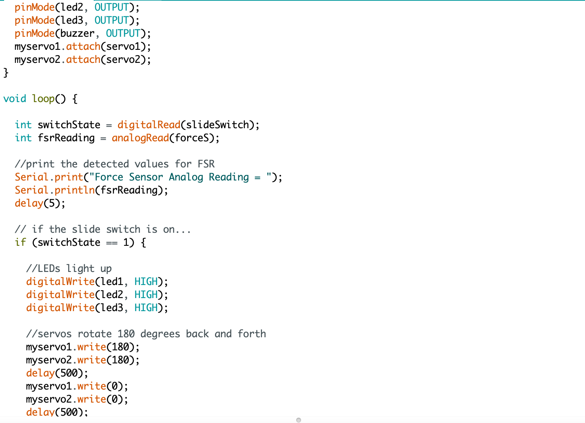
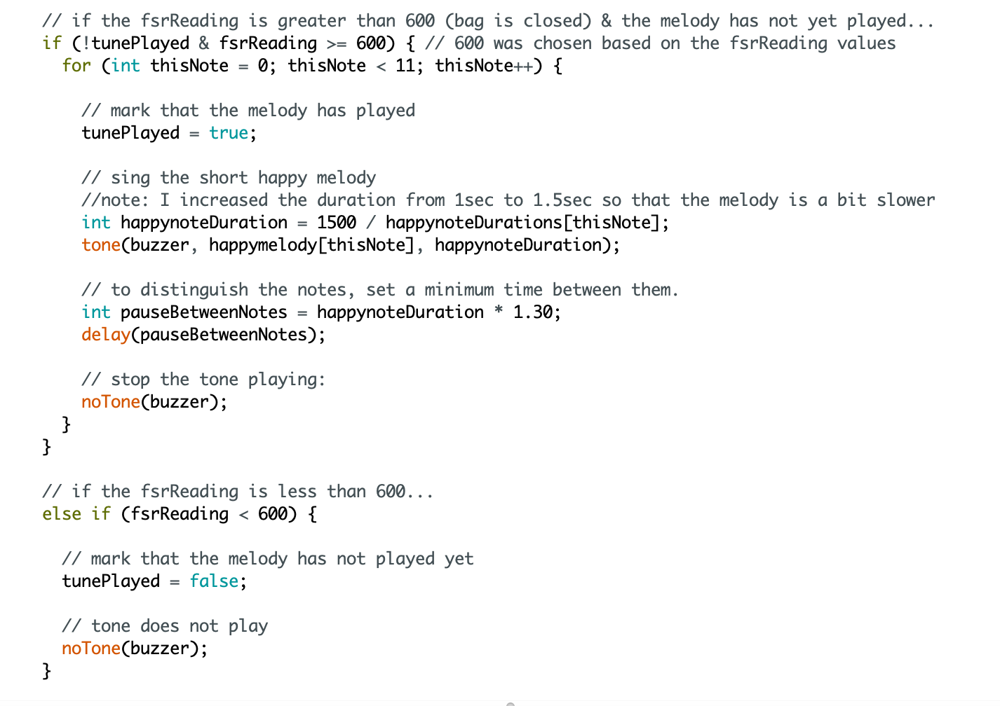
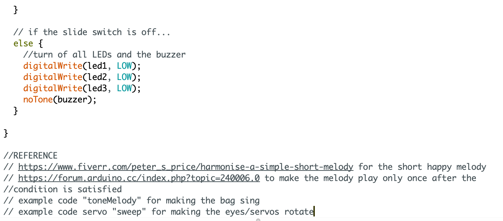

## HappyBag: Midterm Project

**[Link to Video](https://www.youtube.com/watch?v=F6Es3urRpkI)**

### Description

My midterm project called HappyBag is an interactive electronic tote bag with a smiley face on it. It has two rotating flower-shaped eyes and a smiling mouth that lights up in green. The bag also sings a short melody when it is closed. 
The user can turn on and off the system by using a slide switch. 

**Components**

The bag has two inputs—a slide switch and FSR—and five outputs—two servos, three LEDs, and one buzzer—as explained below.

1. The slide switch is located inside the bag. Following features work only when the switch is on. I used the "if" statement to accomplish this.
2. Each of the rotating flower-shaped eyes uses a servo motor (two total). The servos are coded to rotate 180 degrees repeatedly, back and forth, through the myservo.write() command.
3. The smiling mouth is made of three green LEDs that light up.
4. The singing feature of the bag uses a piezo buzzer and a force sensitive resistor (FSR). The bag sings a melody once after it gets closed, which is detected through the FSR. Writing this on my code, I first checked the range of analog values for the FSR to determine the threshold, making it so that the servo operates when the FSR value is below the threshold using the "if" statement. Then, I incorporated "tone" and "noTone" commands as well as a boolean variable to make the buzzer sing once.

**Process**

Considering the increasing popularity of electronic wearable products (includiong fashion items), I came up with the idea of making an electronic/interactive tote bag that brings together LED lights, sensors, buzzers, etc.. I wanted it to be fun, delightful, and fashionable.
To begin, I drew the following sketch:

Then, I prototyped my product with a draft schematic. For my prototype, I used five LEDs, not three. Another note is that the pins by which the inputs and outputs are connected to have changed.

When coding, I had to find ways to make some of the features operate in a certain way. For instance, I wanted the buzzer to play the melody only once after the bag is supposedly closed (the FSR value is over 700). To put in this feature, I referred to online resources and found out that I should use a boolean variable. Ultimately, the code worked as shown in this [video of my prototype](https://www.youtube.com/watch?v=slBqEGOy0Qc).

After I was done with prototyping /coding, I moved on to build the final product. I personally found this to be the hardest part since I had to figure out ways to securely and cleanly attach the servos, LEDs, and FSR onto a cotton/tote bag. Also, I've never soldered anything before, so I had to practice doing it. On a side note, I got to learn a different method of connecting wires that does not involve soldering to make the FSR (easily broken when soldered) independent from the breadboard.
Although I went through a lot of trials and errors, I did manage to finish everything, with the photos available on the bottom of this post. One modification I made in this process was decreasing the number of LEDs I use from 5 to 3 since I found using 5 to be too much and possibly messy.

**Potential Improvements**

Thankfully, most of what I planned for the HappyBag turned out to work properly. However, there exist some places for improvement. 
Firstly, although the bag looks clear and simple on the outside, there are a lot of wires inside that make it look messy and not practical for usage. Therefore, I would like to find a way to better organize the wires, especially to prevent them from getting damaged or messed up in some way.
Secondly, I can replace the power source for my project from my computer to a portable USB charger. This way, the bag is portable and can be worn anywhere without the need of a computer!

### Schematic

### Final Product Photos

**Code**

