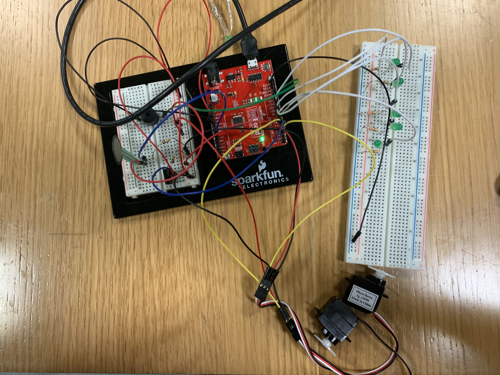

## HappyBag: Midterm Project

**[Link to Video](https://www.youtube.com/watch?v=F6Es3urRpkI)**

### Description

My midterm project called HappyBag is an interactive electronic tote bag with a smiley face on it. It has two rotating flower-shaped eyes and a smiling mouth that lights up in green. The bag also sings a short melody when it is closed. 
The user can turn on and off the system by using a slide switch. 

**Components**

The bag has two inputs—a slide switch and FSR—and five outputs—two servos, three LEDs, and one buzzer—as explained below.

1. The slide switch is located inside the bag. Following features work only when the switch is on.
2. Each of the rotating flower-shaped eyes uses a servo motor (two total). The servos are coded to rotate 180 degrees repeatedly, back and forth.
3. The smiling mouth is made of three green LEDs that light up.
4. The singing feature of the bag uses a piezo buzzer and a force sensitive resistor (FSR). The bag sings a melody once after it gets closed, which is detected through the FSR.

**Process**

Considering the increasing popularity of electronic wearable products (includiong fashion items), I came up with the idea of making an electronic/interactive tote bag that uses LED lights, sensors, buzzers, etc.. I wanted it to be fun, delightful, and fashionable.
To begin, I drew the following sketch:

Then, I prototyped my product with a draft schematic. For my prototype, I used five LEDs, not three. Another note is that the pins by which the inputs and outputs are connected to have changed.

When coding, I had to find ways to make some of the features operate in a certain way. For instance, I wanted the buzzer to play the melody only once after the bag is supposedly closed (the FSR value is over 700). To put in this feature, I referred to online resources and found out that I should use a boolean variable. Ultimately, the code worked as shown in this [video of my prototype](https://www.youtube.com/watch?v=F6Es3urRpkI).

After I was done with prototyping /coding, I moved on to build the final product. I personally found this to be the hardest part since I had to figure out ways to securely and cleanly attach the servos, LEDs, and FSR onto a cotton/tote bag. Also, I've never soldered anything before, so I had to practice doing it. On a side note, to make the FSR (easily broken when soldered) independent from the breadboard, I got to learn a different method of connecting wires that does not involve soldering. 
Although I went through a lot of trials and errors, I did manage to finish everything.

### Schematic

### Final Product Photos

**Code**
